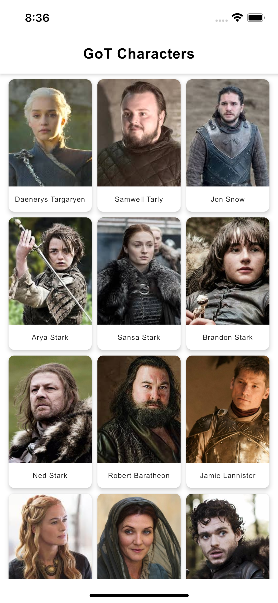
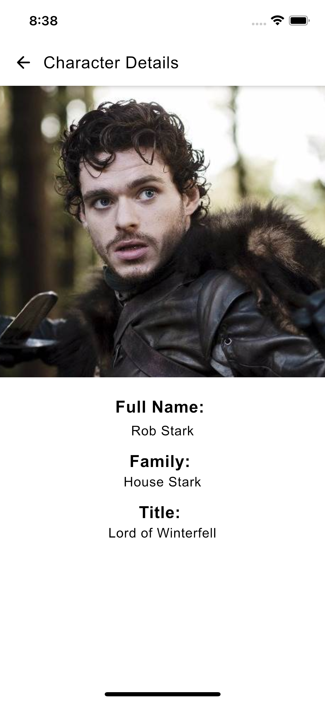
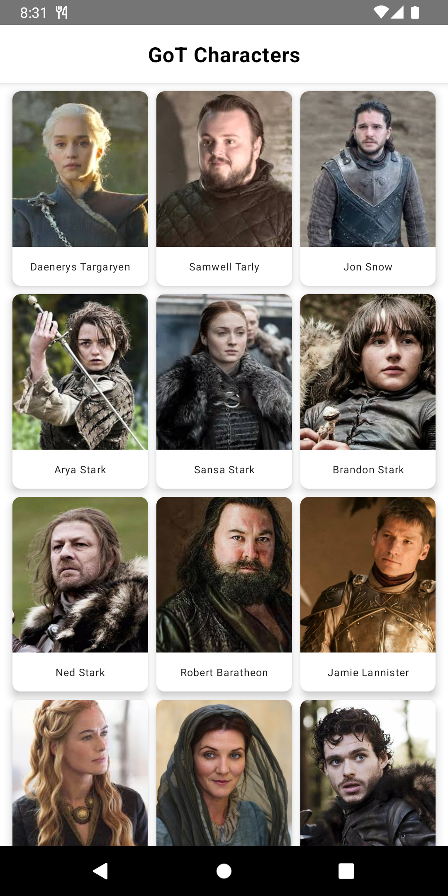
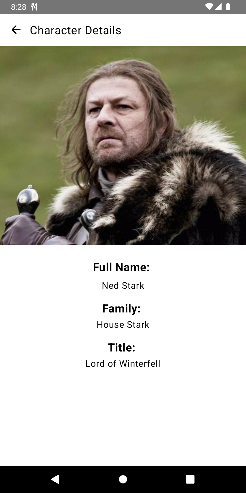

# GoTCharactersKMP
A sample app that shows how to use Kotlin Multiplatform (KMP) to share code between Android and iOS. It uses [Thrones API](https://thronesapi.com/api/) to fetch characters from Game of Thrones.

## Tech Stack.
- [Voyager](https://github.com/adrielcafe/voyager) - A multiplatform navigation library built for, and seamlessly integrated with, Jetpack Compose.
- [Koin](https://insert-koin.io/) - A pragmatic lightweight dependency injection framework for Kotlin developers.
- [Ktor](https://ktor.io/) - A framework for quickly creating connected applications in Kotlin with minimal effort.

## Demo
### iOS
 

#### Android
 

## Resources
* [Compose Multiplatform iOS+Android Application project template](https://github.com/JetBrains/compose-multiplatform-ios-android-template)
